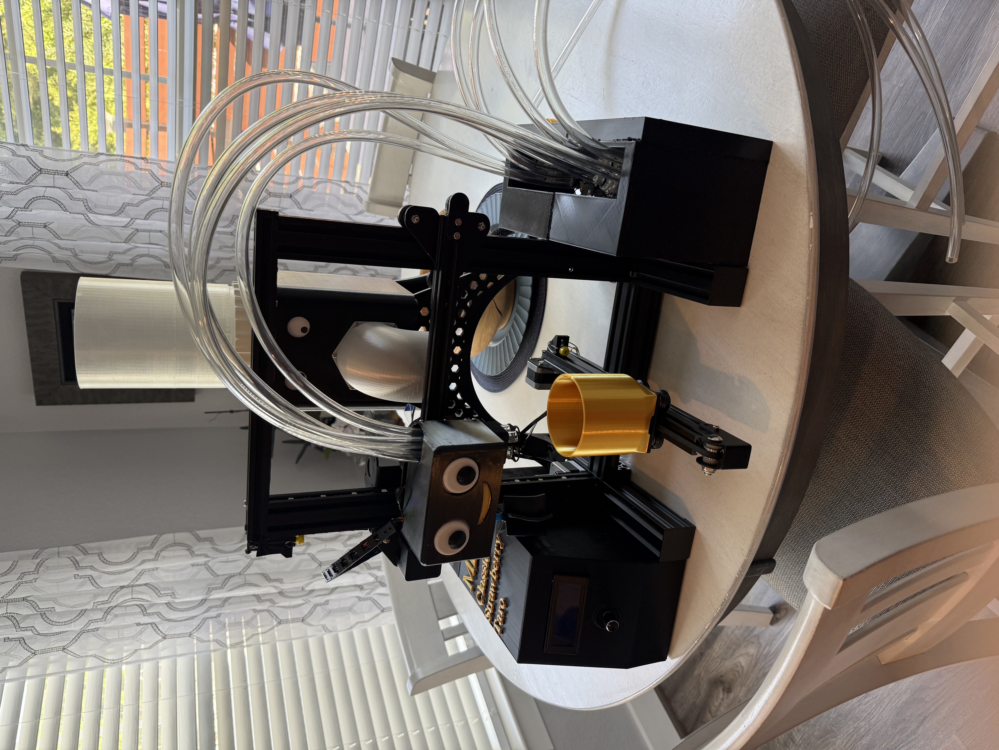
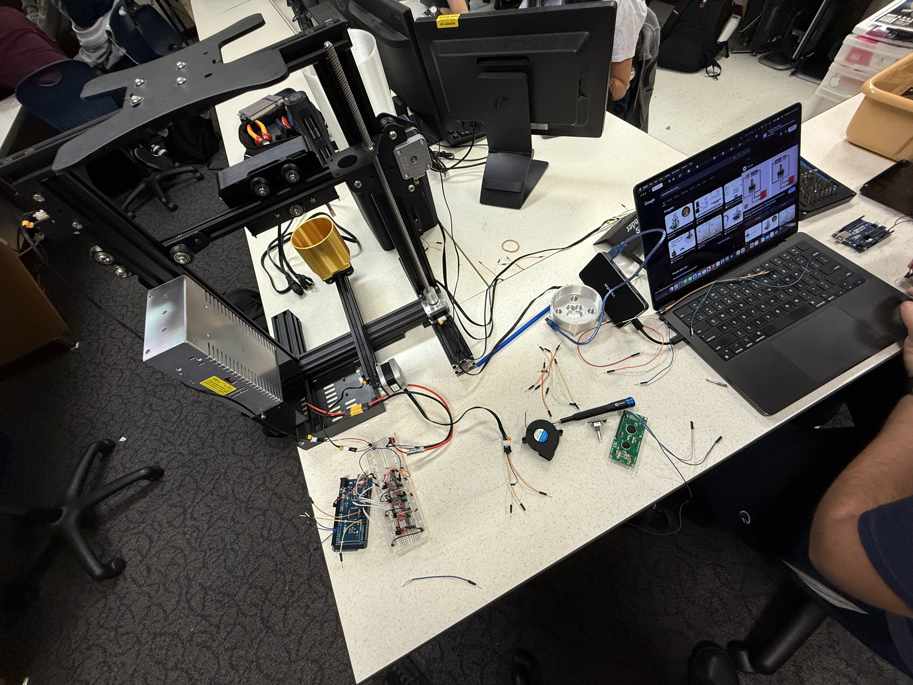
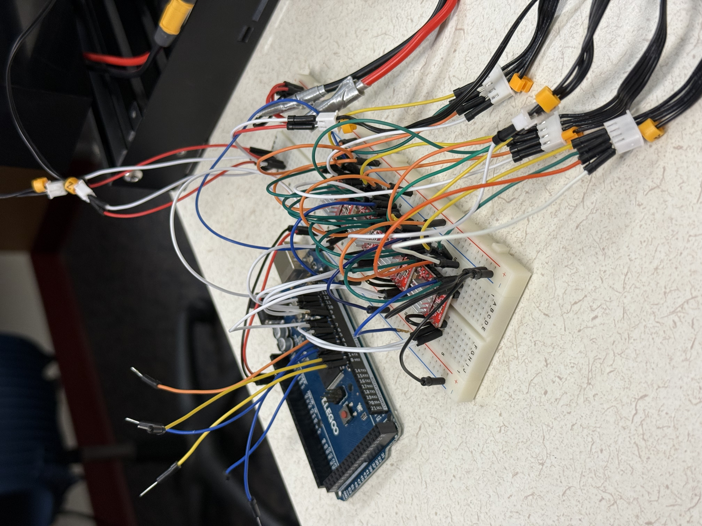

</head>
<body>

<h1>🧋 Bubba Boba</h1>

<strong>An Arduino-powered, fully-automated boba drink dispenser.</strong>

  <h2>✨ Project Overview</h2>
  
<strong>Bubba Boba</strong> is a fully autonomous boba drink-making robot built using two coordinated Arduino boards: an Arduino Mega and an Arduino Uno. The Mega handles all user interface logic, relay sequencing, and drink recipe control. The Uno exclusively controls mechanical movement: stepper motors, servos, limit switches, and mixers. Together, they synchronize to deliver a customizable, fully-automated boba experience.

  
Users can navigate a menu via rotary encoder and LCD display, select a drink, and watch as the machine pours milk, adds flavor, mixes the drink, and finally dispenses boba. A final presentation sequence slides the cup out to the user for pickup. A full-system cleaning mode is also included for maintenance.

  <h2>🧠 How It Works (System Architecture)</h2>
  <ul>
    <li><strong>Arduino Mega:</strong> Handles all logic, UI, and relay control.
      <ul>
        <li>Displays menu on LCD and processes rotary encoder input</li>
        <li>Controls timing and sequencing of drink-making steps</li>
        <li>Manages relays for milk and flavor dispensing</li>
        <li>Sends light signal to Uno via onboard LED or relay circuit</li>
      </ul>
    </li>
    <li><strong>Arduino Uno:</strong> Handles mechanical automation.
      <ul>
        <li>Homes all axes on startup using limit switches (X, Y, Z)</li>
        <li>Moves cup into mixing, dispensing, and boba positions</li>
        <li>Operates syrup servo, mixer motor, and boba shaker</li>
        <li>Begins execution when a photoresistor detects the light signal from Mega</li>
      </ul>
    </li>
    <li><strong>Communication:</strong>
      <ul>
        <li>Photoresistor on Uno reads light intensity from a pin-controlled LED on Mega</li>
        <li>Simple analog-based “GO” signal used to trigger the movement sequence</li>
        <li>One-way communication — minimal wiring, no serial protocol needed</li>
      </ul>
    </li>
    <li><strong>Scripts:</strong>
      <ul>
        <li><code>main.ino</code> – runs on Mega (UI, logic, pumps, LED)</li>
        <li><code>movement_sequence.ino</code> – runs on Uno (motors, servo, mixer)</li>
        <li>All other .ino files are test scripts for subsystems (not used in production)</li>
      </ul>
    </li>
  </ul>

  <h2>🧰 Features</h2>
  <ul>
    <li>Rotary encoder + 20x4 LCD menu system</li>
    <li>Preset drinks: Classic Tea, Strawberry Milk, Taro Milk Tea</li>
    <li>Servo-controlled syrup dispenser</li>
    <li>Milk and flavor pumps controlled by relays</li>
    <li>Stepper gantry motion on 3 axes</li>
    <li>Boba dispensing via dedicated stepper + shaker motor</li>
    <li>NeoPixel LED animations during each drink phase</li>
    <li>Full-system cleaning mode (30s all-pump activation)</li>
    <li>Diagnostics + manual axis control menus</li>
  </ul>

  <h2>💸 Updated Cost Breakdown</h2>
  
<strong>All items (except milk) were purchased from Amazon.</strong>

  
<strong>The lead screw kit used is generic and is applied throughout the project.</strong>

  
<strong>More detailed parts, source links, and specifications are included in the separate BOM file (Bill of Materials).</strong>

  <table>
    <thead>
      <tr><th>Item</th><th>Quantity</th><th>Unit Price</th><th>Total Price</th></tr>
    </thead>
    <tbody>
      <tr><td><strong>Electronics & Hardware</strong></td><td></td><td></td><td></td></tr>
      <tr><td>Arduino Mega 2560</td><td>1</td><td>$49.65</td><td>$49.65</td></tr>
      <tr><td>I2C 20x4 LCD Display</td><td>1</td><td>$13.76</td><td>$13.76</td></tr>
      <tr><td>Rotary Encoder</td><td>1</td><td>$8.89</td><td>$8.89</td></tr>
      <tr><td>V-Slot Screws (25 pcs)</td><td>1</td><td>$2.36</td><td>$2.36</td></tr>
      <tr><td>Buttons (for axis limits)</td><td>3</td><td>$1.00</td><td>$3.00</td></tr>
      <tr><td>Lead Screw Kit</td><td>1</td><td>$18.45</td><td>$18.45</td></tr>
      <tr><td>Stepper Motor (Single)</td><td>1</td><td>$14.32</td><td>$14.32</td></tr>
      <tr><td>Motor Drivers (4-pack)</td><td>1</td><td>$9.99</td><td>$9.99</td></tr>
      <tr><td>12V DC Motor</td><td>1</td><td>$14.99</td><td>$14.99</td></tr>
      <tr><td>Mini 5V Motors (3-pack)</td><td>1</td><td>$7.99</td><td>$7.99</td></tr>
      <tr><td>Buck Converters (3-pack)</td><td>1</td><td>$14.99</td><td>$14.99</td></tr>
      <tr><td>120mm Fans</td><td>2</td><td>$6.00</td><td>$12.00</td></tr>
      <tr><td>Acrylic Sheets</td><td>2</td><td>$10.00</td><td>$20.00</td></tr>
      <tr><td>Cups (100-pack)</td><td>1</td><td>$16.99</td><td>$16.99</td></tr>
      <tr><td>Boba Flavor Kits</td><td>3</td><td>$22.00</td><td>$66.00</td></tr>
      <tr><td>Milk</td><td>2</td><td>$4.50</td><td>$9.00</td></tr>
      <tr><td>Thin Wood Sheets (6-pack)</td><td>1</td><td>$10.00</td><td>$10.00</td></tr>
      <tr><td>Diaphragm Pumps</td><td>4</td><td>$8.00</td><td>$32.00</td></tr>
      <tr><td>LED Strips (optional)</td><td>2</td><td>$10.00</td><td>$20.00</td></tr>
      <tr><td>Relay Modules (10-pack)</td><td>1</td><td>$12.00</td><td>$12.00</td></tr>
      <tr><td>Tubing</td><td>1</td><td>$5.00</td><td>$5.00</td></tr>
      <tr><td><strong>Recycled Ender 3 V1 Parts (Rails, Mounts, Power Supply)</strong></td><td>–</td><td>$0.00</td><td>$0.00</td></tr>
      <tr><td>Black PLA (2 partial rolls)</td><td>1</td><td>$15.00</td><td>$15.00</td></tr>
      <tr><td>Gold PLA (partial roll)</td><td>1</td><td>$7.50</td><td>$7.50</td></tr>
      <tr><td>Gray PLA (partial roll)</td><td>1</td><td>$7.50</td><td>$7.50</td></tr>
      <tr><td>Clear PLA (partial roll)</td><td>1</td><td>$7.50</td><td>$7.50</td></tr>
      <tr><td>White PLA (partial roll)</td><td>1</td><td>$7.50</td><td>$7.50</td></tr>
      <tr><th colspan="3">Total Estimated Cost</th><th>$450.83</th></tr>
    </tbody>
  </table>

  <h3>📝 Notes</h3>
  <ul>
    <li>Prices are based on average market values as of May 2025 and may vary depending on supplier and shipping.</li>
    <li><strong>Tariff and import duty costs are not reflected in these estimates.</strong></li>
    <li>Partial PLA rolls are estimated at 50% of a full roll (approx. 500g).</li>
    <li>Optional components (e.g., LED strips) can be excluded to lower costs.</li>
    <li>Most <strong>design elements</strong> were 3D printed; their cost is factored into filament pricing.</li>
  </ul>

  <h2>📊 Project Timeline (Gantt Chart)</h2>
  

  <h2>📸 Demo Gallery</h2>
  

    <h4>LCD UI</h4>
    
    <h4>Final Build</h4>
    
    <h4>Ground Zero (Workstation Chaos)</h4>
    
    <h4>LED Strip Animation</h4>
    
    <h4>Stepper Motor Homing Sequence</h4>
    
    <h4>Main Board Wiring</h4>
    
    <h4>Stepper Motors on Mega</h4>
    
    <h4>Wire Management</h4>
    
  

  <h2>🔌 Wiring Overview</h2>
  
All wiring documentation is included in <code>/docs</code>. Major components include:

  <ul>
    <li>10V power for motors and pumps</li>
    <li>6V regulated for logic boards</li>
    <li>Limit switches on all axes</li>
    <li>Relay-controlled liquid pumps</li>
    <li>LED → photoresistor communication line between Mega and Uno</li>
  </ul>

      <h2>🔌 Bubba Boba Wiring Diagram</h2>
  

  <h2>📜 License</h2>
  
This project is licensed under the <a href="https://opensource.org/licenses/MIT" target="_blank">MIT License</a>.

  <h2>🙌 Credits</h2>
  
Created by <strong>Charles Mastromatteo, Sabrina Maule, and Vincent Larson</strong>

  
Special thanks to: Arduino forums, Adafruit libraries, and the online maker community.

</body>
</html>
